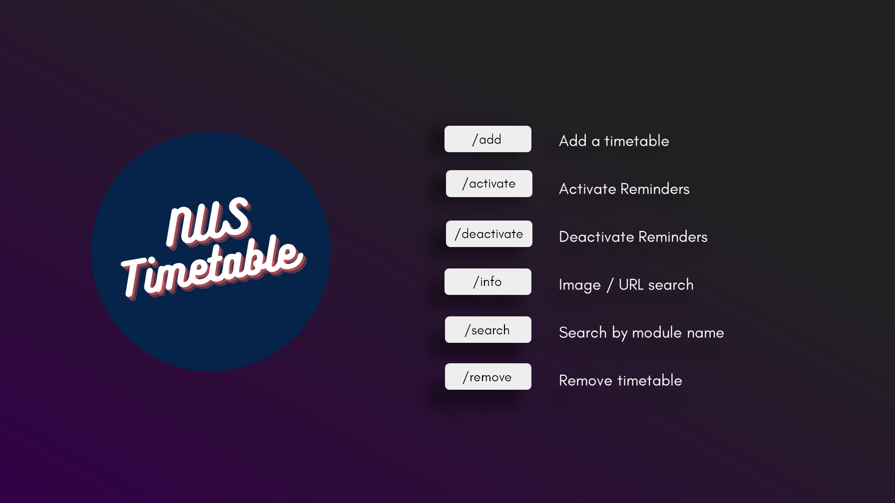

# NUS Timetable Reminders Bot
A Telegram bot that allows users to <b>save</b> their NUS timetable and <b>receive custom alerts</b> in advance before a class!

 

  

<h3 align="center">NUS Timetable Reminders</h3>

  

     
    <a href="https://telegram.me/nus_timetable_assist_bot"><strong>@nus_timetable_assist_bot</strong></a>
     
    <a href="https://github.com/nicleejy/NUS-Timetable-Reminders/issues">Report Bug</a>
    ·
    <a href="https://github.com/nicleejy/NUS-Timetable-Reminders/issues">Request Feature</a>
  

# About
Having trouble remembering when your next lesson begins? In addition to automatically creating personalised reminders for each user based on their timetables, this bot also serves as a proxy to NUS Mods by parsing https://nusmods.com/ and getting real time module information from its database.  

  

Other useful features include:
- **Timetable Image Recognition** (Obtain module info simply by sending in a photo of your timetable)
- **Weekly Overview** (Get a weekly overview of upcoming lessons, refreshed daily)
- **Module Search** (Search and obtain info for any module from the NUS Mods database)

(<a href="#top">back to top</a>)

# Features

  

  

  

  

## Obtain Module Details

  

## Commands

  

(<a href="#top">back to top</a>)

# Technologies

* [Python](https://www.python.org/)
* [MongoDB Atlas](https://www.mongodb.com/atlas/database)
* [Heroku](https://www.heroku.com)
* [NUSMods API](https://api.nusmods.com/v2/)
* [OCRSPace API](https://ocr.space/ocrapi)

(<a href="#top">back to top</a>)

### Motivation 
As a confused Year 1 student in NUS, during the module registration phase, I faced difficulties trying to come up with a suitable timetable. Despite there being many fantastic available online resources for timetable planning, I still found myself having numerous tabs open to compare module information, sometimes having to search for the same module more than once if the tabs were accidentally closed.

The idea for this bot came about because I noticed there was no platform available to compare modules quickly and effectively, and obtaining module information from a Telegram Bot seemed like a better alternative to browsing webpages. Moreover, instead of having to save class dates and timings manually into a calendar, I figured it would be more convenient to let a bot handle the creation of reminders and sending of alerts. 

### Privacy
- Only the user's unique Telegram ID and timetable information are written to the database.
- Stored timetables can be removed by using the `/remove` command
- This bot does not collect other personally identifiable information from users
- Do not use this service to upload confidential information

### Acknowledgements
This app makes use of data from:
- NUS Mods (https://api.nusmods.com/v2/)

## Contributing

Contributions are what make the open source community such an amazing place to learn, inspire, and create. Any contributions you make are **greatly appreciated**.

If you have a suggestion that would make this better, please fork the repo and create a pull request.

(<a href="#top">back to top</a>)

## License

Distributed under the MIT License. See `LICENSE.txt` for more information.

(<a href="#top">back to top</a>)

## Support
Contributions, issues, and feature requests are welcome!
- Give a ⭐️ if you like this project!
- Share https://telegram.me/nus_timetable_assist_bot on Telegram!

<!-- CONTACT -->
## Contact

Nicholas Lee: nic.leejunyi@gmail.com

Project Link: [https://github.com/github_username/repo_name](https://github.com/github_username/repo_name)

(<a href="#top">back to top</a>)

