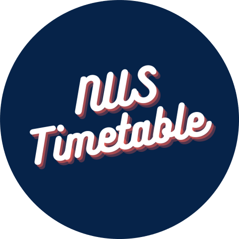
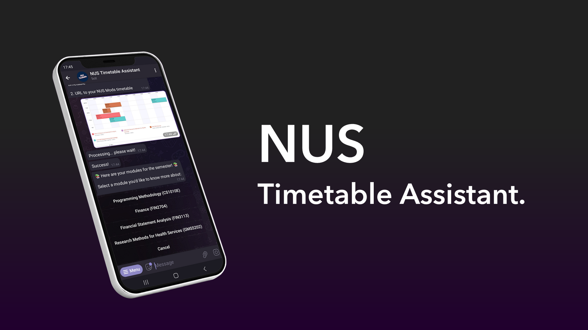
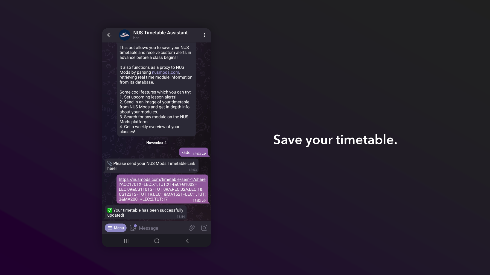
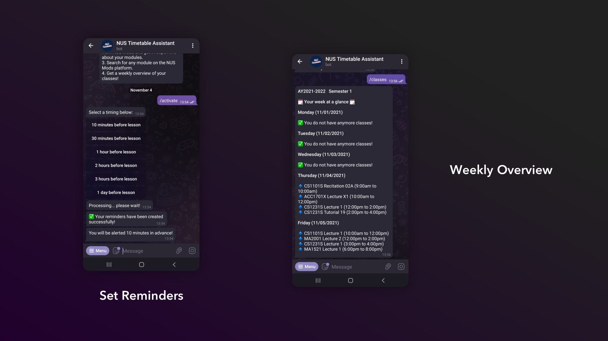
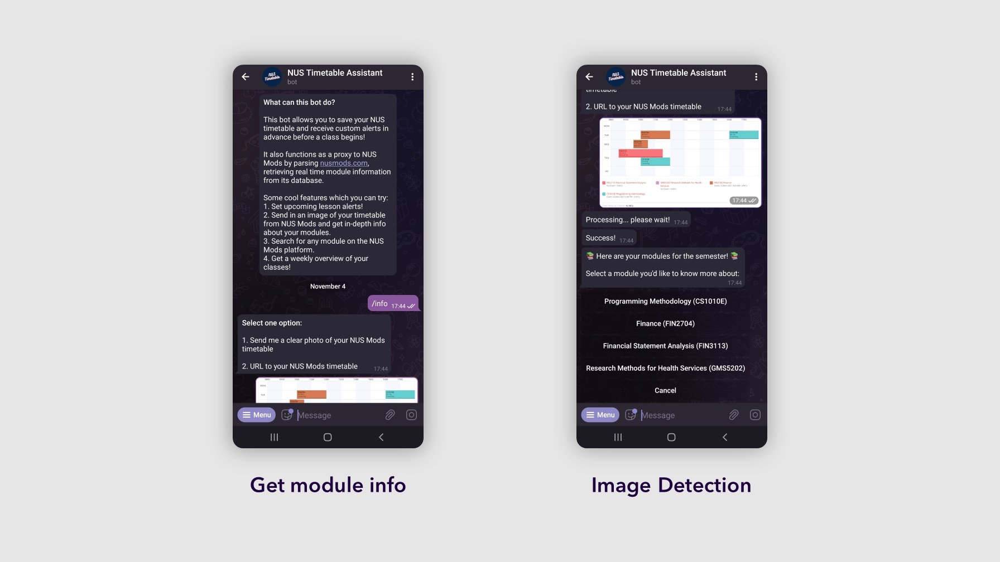
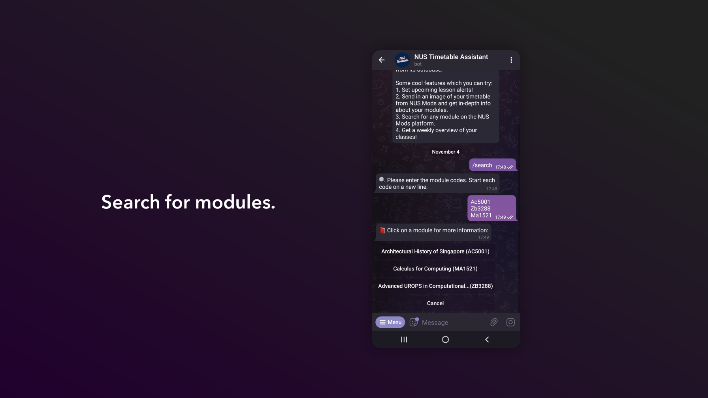

<div id="top"></div>

# NUS Timetable Reminders Bot
A simple and intuitive Telegram bot that allows students from the National University of Singapore to <b>save</b> their NUS timetable and <b>receive custom alerts</b> in advance before a class! 


<br />
<div align="center">
  <a href="https://github.com/github_username/repo_name">
    
  </a>

<h3 align="center">NUS Timetable Reminders</h3>

  <p align="center">
    <br />
    <a href="https://telegram.me/nus_timetable_assist_bot"><strong>@nus_timetable_assist_bot</strong></a>
    <br />
    <a href="https://github.com/nicleejy/NUS-Timetable-Reminders/issues">Report Bug</a>
    ·
    <a href="https://github.com/nicleejy/NUS-Timetable-Reminders/issues">Request Feature</a>
  </p>
</div>

# About
Having trouble remembering when your next lesson begins? In addition to automatically creating personalised reminders for each user based on their timetables, this bot also serves as a proxy to NUS Mods by parsing https://nusmods.com/ and getting real time module information from its database.<br/><br/>

<p align="center">

</p><br/><br/>

Other useful features include:
- **Timetable Image Recognition** (Obtain module info simply by sending in a photo of your timetable)
- **Weekly Overview** (Get a weekly overview of upcoming lessons, refreshed daily)
- **Module Search** (Search and obtain info for any module from the NUS Mods database)
<p align="right">(<a href="#top">back to top</a>)</p>

# Features

<p align="center">

</p><br/><br/>
<p align="right">(<a href="#top">back to top</a>)</p>
<p align="center">

</p><br/><br/>

<p align="right">(<a href="#top">back to top</a>)</p>
<p align="center">

</p><br/><br/>

<p align="right">(<a href="#top">back to top</a>)</p>

<p align="center">

</p><br/><br/>

<p align="right">(<a href="#top">back to top</a>)</p>

## Obtain Module Details
<p align="center">

</p><br/><br/>

<p align="right">(<a href="#top">back to top</a>)</p>

## Commands
1. `/menu` - Bring up main menu
2. `/add` - Save a timetable
3. `/activate` - Turn on alerts, set reminders timings
4. `/deactivate` - Turn off alerts
5. `/remove` - Remove timetable and clear all pending alerts
6. `/search` - Search for a module by module code (case-insensitive)
7. `/info` - Get information about a timetable from URL or image
8. `/cancel` - Clear all running tasks
9. `/classes` - Obtain a weekly overview of your timetable
10. `/bugs` - To report issues

<p align="right">(<a href="#top">back to top</a>)</p>

# Technologies

* [Python](https://www.python.org/)
* [MongoDB Atlas](https://www.mongodb.com/atlas/database)
* [Heroku](https://www.heroku.com)
* [APScheduler](https://pypi.org/project/APScheduler/2.1.2/)
* [NUSMods API](https://api.nusmods.com/v2/)
* [OCRSPace API](https://ocr.space/ocrapi)
* [Telegram API](https://core.telegram.org/)
* [pyTelegramBotAPI](https://github.com/eternnoir/pyTelegramBotAPI)

<p align="right">(<a href="#top">back to top</a>)</p>


### Motivation 
As a confused Year 1 student in NUS, during the module registration phase, I faced difficulties trying to come up with a suitable timetable. Despite there being many fantastic available online resources for timetable planning, I still found myself having numerous tabs open to compare module information, sometimes having to search for the same module more than once if the tabs were accidentally closed.

The idea for this bot came about because I noticed there was no platform available to compare modules quickly and effectively, and obtaining module information from a Telegram Bot seemed like a better alternative to browsing webpages. Moreover, instead of having to save class dates and timings manually into a calendar, I thought it would be more convenient to let a bot handle the creation of reminders and sending of alerts.

This is my first ever programming project and there is alot that can be improved on in terms of code design and user process flow. Suggestions for improvement are welcome!

### Project Details 

The back-end was written in Python and served from Heroku, with the help of the implementation, <a href="https://github.com/eternnoir/pyTelegramBotAPI">pyTelegramBot API</a> from Eternnoir. Because of the nature of the reminders system, it was necessary for the bot to be persistent. A solution was to implement an external cloud database that communicates with the script directly. User timetables, when submitted, are stored in a <a href="https://www.mongodb.com/atlas/database">MongoDB Atlas</a> database along with a generated list of reminders from their respective classes. The post also retains user state, such as whether reminders are active and a job list of unique job IDs if there scheduled reminders are activated.

To schedule jobs with custom clock processes, it was necessary to use a package other than the built in Heroku Scheduler, which only schedules jobs at intervals. APScheduler was chosen because it is lightweight, easy to use, runs in the background via a separate thread, and able to integrate with the MongoDB Atlas database through a job store. Each job has a unique ID attributed to the user, along with a universally unique identifier (UUID) to ensure that each reminder can be traced for deletion if required.<br/><br/> 

```python
def schedule_jobs(job_list, userID, timing):
    list_of_job = []
    for job in job_list:
        uniqueID = "user-" + str(userID) + "-" + str(uuid.uuid4())
        list_of_job.append(uniqueID)
        scheduler.add_job(make_reminder, 'date', run_date=job[1], args=[job, userID, timing], jobstore="mongo", replace_existing=True, id=uniqueID)
    collection.update_one({"_id": userID}, {"$set":{"list_of_jobs": list_of_job}})
```
<br/><br/> 
When timetables are saved, a list of reminders with a unique datetime object and other required information is generated. This provides the data to the scheduler, enabling it to display the correct module information at the right time. The reminders are generated on a weekly basis following the specified weeks of each module found in the NUSMods database.<br/><br/> 
```python
 {"weeks": [1, 2, 3, 4, 5, 6, 7, 8, 9, 10, 11, 12, 13]}
 #Generates a reminder list of consecutive weeks, taking into account recess week
 
 {"weeks": [2, 4, 6, 8, 10, 12]}
 #Generates a reminder list of alternate weeks, also taking into account recess week
```
<br/><br/> The bot has multiple callback handlers and process flows, which made it crucial to maintain a local user state. For example, the addition of a timetable `/add` is a 2 step process while searching for module information `/info` is a 3 step processes. Each step has to listen for a specific input from the user (URLs, Images, Text, Button presses) and respond accordingly. In order to prevent conflict, I used a local nested dictionary which maintains the state of each user. Each entry has a key which represents the unique Telegram ID of the user as shown:<br/><br/>
```python
user_state[userID] = {"addTimetable": False, "getModuleInfo": "bug", "result": [], "setTime": False, "modData":[], "isoModule":"", "reminder": False} 
```
<br/><br/>When the temporary process is complete, the entry for that particular user will be removed in order to reduce data storage. To ensure that the data is up to date, a Cron trigger is setup to repeat daily at 4.30am in order to refresh the current academic year and semester. In addition, it also parses the documents in the database to check if any timetables do not fall within the same category and removes them. The list of reminders is also being consistently updated so that the user receives the most recent timetable information.<br/><br/>
```python
def updateReminderList(list_of_reminders):
    now = datetime.datetime.now()
    updated_reminders = []
    for data in list_of_reminders:
        if now <= data[1]:
            updated_reminders.append(data)
    return updated_reminders
 ```
 <br/><br/>The image search feature was a fun add-on that I decided to implement to give users the added convenience of looking up information from their timetables on to go. It makes use of <a href="https://ocr.space/ocrapi">OCRSpace API</a>, a free Optical Character Recognition API. Upon return of the parsed text, the bot will look for keywords and search through the NUSMods database and return the modules matching those keywords.
 
Error handling was one of the more time consuming aspects of the project. Some examples are if the user:
- Activates buttons that were previously generated
- Skips between different process flows
- Sends in an invalid URL or image
There are multiple exception handlers present in the source code to prevent crashes if the user performs something unexpected.

To catch invalid URLs, I used the <a href="https://pypi.org/project/validator/">Validator</a> package which checks to see if the URL is indeed from NUSMods and is a valid link, before the bot performs any other tasks on the URL. 

### Privacy
- Only the user's unique Telegram ID and timetable information are written to the database.
- Stored timetables can be removed by using the `/remove` command
- This bot does not collect other personally identifiable information from users
- Please do not use this service to upload confidential information

### Acknowledgements
1. This app makes use of data from:
- NUS Mods (https://api.nusmods.com/v2/)
2. A big thank you to all my friends who kindly helped to test and report bugs for this bot!


# Contributing

Contributions are what make the open source community such an amazing place to learn, inspire, and create. Any contributions you make are **greatly appreciated**.

If you have a suggestion that would make this better, please fork the repo and create a pull request.

<p align="right">(<a href="#top">back to top</a>)</p>


# License

Distributed under the MIT License. See `LICENSE.txt` for more information.

<p align="right">(<a href="#top">back to top</a>)</p>

# Support
Contributions, issues, and feature requests are welcome!
- Give a ⭐️ if you like this project! 
- Share https://telegram.me/nus_timetable_assist_bot on Telegram!


<!-- CONTACT -->
# Contact

Nicholas Lee: nic.leejunyi@gmail.com

Project Link: [https://github.com/github_username/repo_name](https://github.com/github_username/repo_name)

<p align="right">(<a href="#top">back to top</a>)</p>
